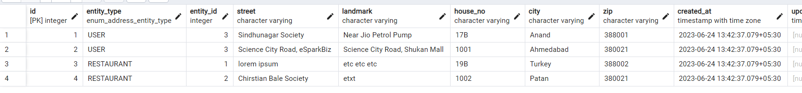

# Association Practice Task Given By JK-Sir.

## One To One Relationship

For, one to one relationship, I decided to create schema in a following way:
One "Order" will have only one "Payment".

And this is how it is generating response.

```
{
    "order": {
        "id": 3,
        "user_id": 3,
        "price": 500,
        "status": "DELIVERED",
        "created_at": "2023-06-24T12:11:28.604Z",
        "updated_at": null,
        "Payment": {
            "id": 2,
            "order_id": 3,
            "status": "PENDING",
            "created_at": "2023-06-24T12:49:26.119Z",
            "updated_at": null
        }
    }
}
```

## One To Many Relationship

For one to many I have decided to design to approaches.

- One User can add multiple restaurants in his "Favourites" tab.
- One User can order multiple times. Basically one user can have multiple orders.

I have done One to Many with both techniques Lazy Loading and Eager Loading.

And this is how One to Many Generates response.

#### For Favourite Restaurants

```
{
    "favourites": [
        {
            "id": 1,
            "user_id": 3,
            "Restaurant": {
                "id": 1,
                "name": "Pizzerial",
                "owner": "Bakul Joshi",
                "created_at": "2023-06-24T08:10:57.655Z",
                "updated_at": null,
                "deleted_at": null
            }
        },
        {
            "id": 3,
            "user_id": 3,
            "Restaurant": {
                "id": 3,
                "name": "KFC",
                "owner": "Tushar Rupani",
                "created_at": "2023-06-24T08:10:57.655Z",
                "updated_at": null,
                "deleted_at": null
            }
        }
    ],
    "message": "Favourites for user 3 fetched!"
}
```

#### For Multiple Orders

```
{
    "orders": [
        {
            "id": 3,
            "user_id": 3,
            "price": 500,
            "status": "DELIVERED",
            "created_at": "2023-06-24T12:11:28.604Z",
            "updated_at": null
        },
        {
            "id": 2,
            "user_id": 3,
            "price": 400,
            "status": "PENDING",
            "created_at": "2023-06-24T12:11:28.604Z",
            "updated_at": null
        }
    ]
}
```

## Many To Many Relationship

A restaurant can have multiple tag/badge and same as a single tag can be assigned to multiple restaurant. There lies the Many to Many Relationship.

```
{
    "restaurantWithTags": {
        "id": 1,
        "name": "Pizzerial",
        "owner": "Bakul Joshi",
        "created_at": "2023-06-24T08:10:57.655Z",
        "updated_at": null,
        "deleted_at": null,
        "Tags": [
            {
                "name": "Fast Food",
            },
            {
                "name": "Italian Cuisine",
            }
        ]
    }
}
```

## Polymorphic Relationship

A user can have multiple address and at a same time a restaurant is also having an address. In this case this is how I am managing my table to make it polymorphic.


